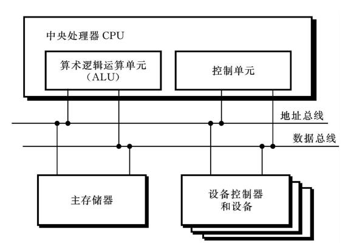
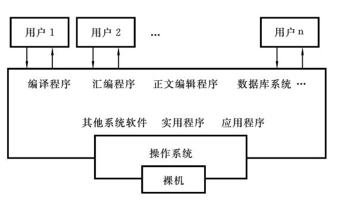
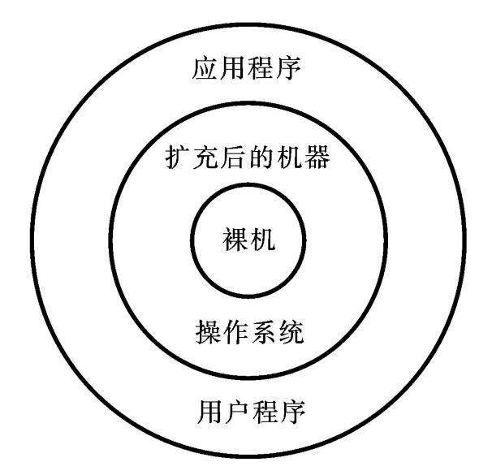
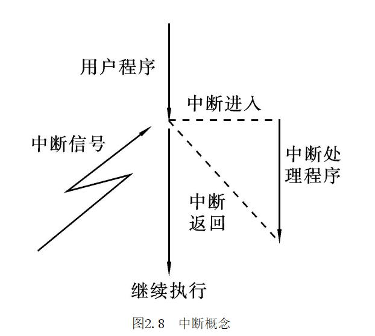
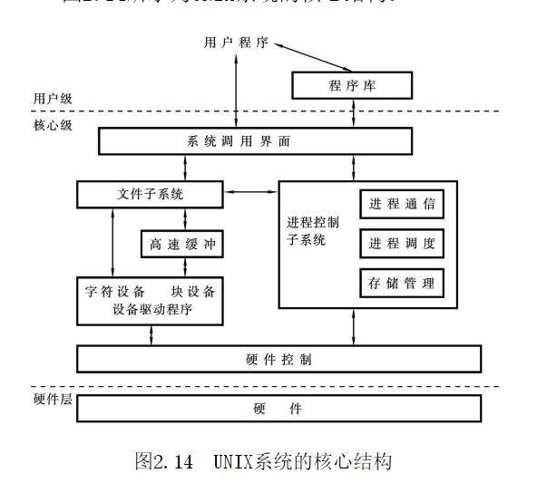
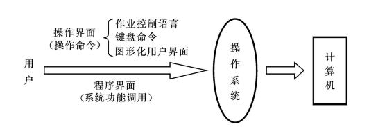
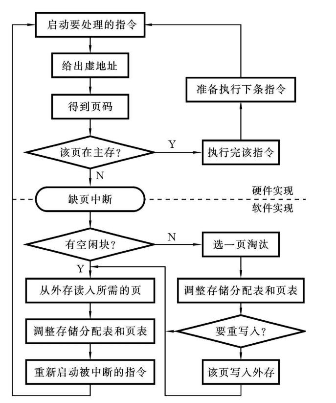
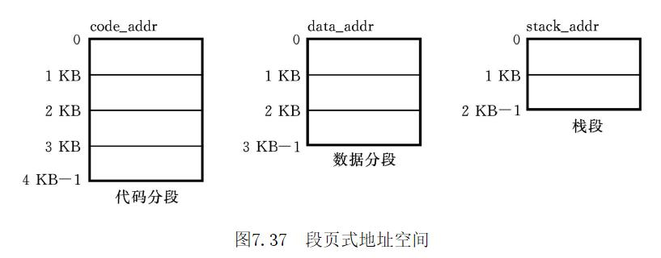

# 信息

《操作系统原理(第4版)》 庞丽萍 华中科技大学出版社

# 摘录

## 绪论

### 存储程序式计算机

- 冯·诺依曼计算机体系结构
  
  从20世纪40年代至今，计算机体系结构不断地发展变化，但冯·诺依曼计算机体系结构定义的一个存储程序式计算机的家族，几乎是当代所有计算机系统的构成基础（除专门设计用于处理特殊任务的计算机外）。存储程序式计算机由中央处理器（处理器（CPU））、存储器和输入／输出设备组成。所有的单元都通过总线连接，总线分为地址总线和数据总线，分别连接不同的部件。
  由于冯·诺依曼型计算机的计算模型是顺序过程计算模型，所以它的特点是集中顺序过程，在当代的CPU中，可有32～64个通用寄存器，每个寄存器能够保存一个32位（bit）的数值。通用寄存器可以为功能单元提供操作数，并能接收、保存操作的结果。控制单元负责从主存储器提取指令、分析其类型，并产生信号通知计算机其他部分执行指令所指定的操作。控制单元包含一个程序计数器（programcounter，PC）和一个指令寄存器（instructionregister，IR）。程序计数器指示下一步应该执行的指令，而指令寄存器包含当前指令的拷贝。

### 操作系统的发展历程

操作系统是构成计算机系统的另一个重要的系统软件，它负责管理计算机系统的硬件、软件资源并控制整个计算机的工作流程。

- 发展历程
  从1950年至今，操作系统的发展主要经历了如下的几个阶段：①手工操作阶段——无操作系统；②批处理系统——早期批处理、执行系统；③操作系统形成——批处理操作系统、分时操作系统、实时操作系统；④现代操作系统——个人计算机操作系统、网络操作系统、分布式操作系统。

- 中断和通道
  20世纪60年代初期，硬件获得了两方面的进展：一是通道的引入；二是中断技术的出现。这两项重大成果导致操作系统进入执行系统阶段。通道是一种专用处理部件，它能控制一台或多台外设的工作，负责外部设备与主存之间的信息传输。它一旦被启动，就能独立于CPU运行，这样就可使CPU和通道并行操作，而且CPU和各种外部设备也能并行操作。所谓中断是指当主机接到某种信号信号（如I/O设备完成信号）时，马上停止原来的工作，转去处理这一事件，当事件处理完毕，主机又回到原来的工作点继续工作。

- 多道程序
  中断和通道技术出现以后，I/O设备和中央处理机可以并行操作，初步解决了高速处理机和低速外部设备的矛盾，提高了计算机的工作效率。但不久又发现，这种并行是有限度的，并不能完全消除中央处理机对外部传输的等待。比如，一个作业在运行过程中依此输入n批数据，每批输入1000个字符，输入机每输入1000个字符需用1000ms，而处理机处理这些数据则需300ms。可见，尽管处理机具有和外部设备并行工作的能力，但是在这种情况下无法让它多做工作，处理机仍有空闲等待现象。那么，为了提高设备的利用率，能否在系统内同时存放几道程序呢？这就引入了多道程序的概念。
  多道程序运行的特征是：①多道——计算机主存中同时存放几道相互独立的程序；②宏观上并行——同时进入系统的几道程序都处于运行过程中，即它们先后开始了各自的运行，但都未运行完毕；③微观上串行——从微观上看，主存中的多道程序轮流或分时地占有处理机，交替执行。

- 分时技术
  当计算机技术和软件技术发展到20世纪60年代中期，由于主机速度不断提高而采用了分时技术，使一台计算机可同时为多个终端用户服务。每个终端用户在自己的终端设备上联机使用计算机，好像自己独占机器一样。

### 操作系统的基本概念

- 计算机系统的组成
  
  操作系统是一个大型的程序系统，它负责计算机系统软、硬件资源的分配和管理；控制和协调并发活动；提供用户接口，使用户获得良好的工作环境。
  操作系统是重要的系统软件，只有配置了操作系统这一系统软件后，才使计算机系统体现出系统的完整性和可利用性。当用户要计算机帮助完成其计算任务时，用户仅编制源程序（用户在源程序中，可以利用操作系统提供的系统调用请求操作系统相应的服务），而其余的大量工作，如作业控制、系统资源的合理分配和利用，各种调度策略的制订、人机联系方式等都是由操作系统实施的。所以，操作系统使整个计算机系统实现了高度自动化、高效率、高利用率、高可靠性。操作系统是整个计算机系统的核心。

- 操作系统的资源管理功能
  操作系统的主要功能是管理系统的软、硬件资源。这些资源按其性质来分，可以归纳为四类：处理机、存储器、外部设备和软件资源。这四类资源就构成了系统程序和用户程序赖以活动的物质基础和工作环境。针对这四类资源，操作系统就有相应的资源管理程序：处理机管理、存储管理、设备管理和软件资源管理程序。这些资源管理程序组成了操作系统这一程序系统。

- 操作系统的基本类型
  （1）批量操作系统；（2）分时操作系统；（3）实时操作系统；（4）个人计算机操作系统；（5）网络操作系统；（6）分布式操作系统。

## 操作系统的组织结构

### 操作系统虚拟机

在裸机上配置了操作系统程序后就构成了操作系统虚拟机。操作系统的核心在裸机上运行，而用户程序则在扩充后的机器上运行。扩充后的虚拟机不仅可以使用原来裸机提供的各种基本硬件指令，而且还可使用操作系统中所增加的许多其他“指令”。这些指令统称为扩充机器的指令系统，又称为操作命令语言。
  
操作系统虚拟机提供了协助用户解决问题的装置，其功能是通过它提供的命令来体现的，用户也是通过这一组命令和操作系统虚拟机打交道的。系统所提供的全部操作命令的集合称为操作命令语言，它是用户和系统进行通信的手段和界面。这一用户界面分为两个方面：操作命令（又称命令接口）和系统功能调用（又称程序接口）。
操作系统在计算机系统中所处的位置是硬件层（裸机）和其他所有软件之间，是所有软件中与硬件相连的第一层软件，它在裸机上运行，又是系统
软件和应用程序运行的基础。它与硬件、应用程序和用户都有接口。具有一体化结构的操作系统提供的接口如下图所示，从该结构中可以看出操作系统提供的多种接口。
  

### 处理机的状态

操作系统是计算机系统中最重要的系统软件，为了能正确地进行管理和控制，其本身是不能被破坏的。为此，系统应能建立一个保护环境，采用的办法是区分处理机的工作状态。因为，在系统中有两类程序在运行，一类是管理程序（如处理机调度程序、主存分配程序、I/O管理程序等）；另一类是用户程序。这两类程序是不同的，前者是管理和控制者，它负责管理和分配系统资源，为用户提供服务。而用户程序运行时，所需资源必须向操作系统提出请求，自己不能随意取用系统资源，如直接启动外部设备进行工作，更不能改变机器状态等。这两类不同程序执行时应有不同的权限，为此根据对资源和机器指令的使用权限，将处理执行时的工作状态区分为不同的状态（或称为模式）。所谓处理机的态，就是处理机当前处于何种状态，正在执行哪类程序。为了保护操作系统，至少需要区分两种状态：管态和用户态。管态（supervisormode）：又称为系统态，是操作系统的管理程序执行时机器所处的状态。在此状态下允许中央处理机使用全部系统资源和全部指令，其中包括一组特权指令（例如，涉及外部设备的输入／输出指令、改变机器状态或修改存储保护的某些指令），允许访问整个存储区。用户态（usermode）：又称为目态，是用户程序执行时机器所处的状态。在此状态下禁止使用特权指令，不能直接取用系统资源与改变机器状态，并且只允许用户程序访问自己的存储区域。有的系统将管理程序执行时的机器状态进一步分为核态和管态，这时，管态的权限有所变化，管态只允许使用一些在用户态下所不能使用的资源，但不能使用修改机器的状态指令。而核态（kernelmode）就具有上述管态所具有的所有权限。无核态的系统，管态执行核态的全部功能。管态比核态权限要低，用户态的权限更低。为了区分处理机的工作状态，需要硬件的支持。在计算机状态寄存器中需设置一个系统状态位（或称模式位）。若有了系统状态位，就可以区分当前正在执行的是系统程序还是用户程序。**若用户程序执行时，超出了它的权限，如要访问操作系统核心数据或企图执行一个特权指令，都将从用户态转为管态，由操作系统得到CPU控制权，处理这一非法操作。这样可以有效地保护操作系统不受破坏。当用户程序执行时，若需要请求操作系统服务，则要通过一种受控方式进入操作系统，将用户态转为核态，由操作系统得到控制权，在核态下执行其相应的服务例程，服务完毕后，返回到用户态，让用户继续执行。**

### 中断机制

所谓中断是指某个事件（例如电源掉电、定点加法溢出或I/O传输结束等）发生时，系统中止现行程序的运行、引出处理该事件程序进行处理，处理完毕后返回断点，继续执行。
  
中断响应的实质是交换指令执行地址和处理器状态，以达到如下目的：①保留程序断点及有关信息；②自动转入相应的中断处理程序执行。中断响应所需的硬件支持包括：指令计数器、处理器状态寄存器、中断向量表和系统堆栈。
整个中断处理的功能是由硬件和软件配合完成的。硬件负责中断进入过程，即发现和响应中断请求，把中断的原因和断点记下来供软件处理时查用，同时负责引出中断处理程序。而中断分析、中断处理、恢复被中断程序的现场等工作则由软件的中断处理程序来完成。
java里数组越界的一场应该算一种中断。

### UNIX系统结构

UNIX系统核心层的功能包括文件管理、设备管理、存储管理和处理机管理，此外还有中断和俘获的处理。**现代计算机系统的硬件机构支持核心态和用户态，使得核心程序在核心态下运行，实用程序在用户态下运行。每一种状态都有自己的栈和栈指针，都有自己的地址映射部件。所以，用户态的程序不能直接访问核心态的程序和数据，只能通过访问管理程序指令（访管指令，如trap指令）自陷到核心内的操作系统服务程序。
UNIX系统的核心结构是一体化结构。**

### 静态连接和动态链接

连接这一处理步骤，以前通常采用静态连接方式。静态连接是将所需的外部调用函数连接到目标文件中形成一个完整的主存映像文件。采用这种静态连接的缺点是，当有多个应用程序都需要调用同一个库函数时，那么，这些应用程序的目标文件中都将包含这个外部函数对应的代码。这将造成主存的极大浪费，不能支持有效的共享。动态链接是将这一连接工作延迟到程序运行的时候进行。它需要的支持是动态链接库（DLL）。动态链接不需要将应用程序所需要的外部函数代码从库中提取出来并连接到目标文件中，而是在应用程序需要调用外部函数的地方作记录，并说明要使用的外部函数名和引用入口号，形成调用链表。当所需的动态链接库DLL在主存时，就可以确定所需函数的主存绝对地址，并将它填入调用链表相应位置中。当应用程序运行时，就可以正确地引用这个外部函数了。现代操作系统有的已采用了动态链接技术，如Windows系统，现在的动态链接库一般是系统库。

### 操作系统提供的用户界面

操作系统提供的用户界面如下图所示：一是操作界面，又称为操作命令；二是程序界面，又称为系统功能调用。

### 系统功能调用

为了实现在程序级的服务支持，操作系统提供统一的系统功能调用，采用统一的调用方式——访问管理程序来实现对这些功能的调用。
**对于用户所需要的功能，由系统设计者事先编制好能实现这些功能的例行子程序，作为操作系统程序模块的一部分。这些例行子程序不能像一般的用户子程序那样可随便调用，因为这些能实现各种功能的例行子程序是操作系统的程序部分，它运行时，机器处于管态（管理程序状态），而用户程序运行时，机器处于用户态。所以，用户程序对这些例行子程序的调用应以一种特殊的调用方式——访管方式来实现。**
这样一个带有一定功能号的访管指令定义了一个系统调用。因此，系统调用是用户在程序一级请求操作系统服务的一种手段，它不是一条简单的硬指令，而是带有一定功能号的访管指令。它的功能并非由硬件直接提供，而是由操作系统中的一段程序完成的，即由软件方法实现的。用户可以用带有不同功能号的访管指令来请求各种不同的功能。可以这样说，系统调用是利用访管指令定义的指令。操作系统服务例程与一般子程序的区别在于，前者所实现的功能都是与计算机系统本身有关的，对前者的调用是通过一条访管指令来实现的。不同的程序设计语言调用操作系统服务的方式是不同的，它们有显式调用和隐式调用之分。**在汇编语言中是直接使用系统调用对操作系统提出各种要求的，因为在这种情况下，系统调用具有汇编指令的形式。而在高级语言中一般是隐式的调用（经编译后转成某种直接调用）。**

## 并发

### 进程概念

#### 进程定义

根据1978年在庐山召开的全国操作系统会议上关于进程的讨论，结合国外的各种观点，国内对进程这一概念作了如下描述：进程是指一个具有一定独立功能的程序关于某个数据集合的一次运行活动。
进程和程序是既有联系又有区别的两个概念，它们的区别如下。（1）程序是指令的有序集合，其本身没有任何运行的含义，它是一个静态概念。而进程是程序在处理机上的一次执行过程，它是一动态概念。程序可以作为一种软件资料长期保存，而进程则是有一定生命期的，它能够动态地产生和消亡。即进程可由“创建”而产生，由调度而执行，因得不到资源而暂停，以致最后由“撤销”而消亡。（2）进程是一个能独立运行的单位，能与其他进程并行地活动。（3）进程是竞争计算机系统有限资源的基本单位，也是进行处理机调度的基本单位。
进程和程序又是有联系的。在支持多任务运行的操作系统中，活动的最小单位是进程。进程一定包含一个程序，因为程序是进程应完成功能的逻辑描述；而一个程序可以对应多个进程。如果同一程序同时运行于若干不同的数据集合上，它将属于若干个不同的进程。或者说，若干不同的进程可以包含相同的程序。这句话的意思是：用同一程序对不同的数据先后或同时加以处理，就对应于好几个进程。例如，系统具有一个C语言编译程序，当它对多个终端用户的C语言源程序进行编译时，就产生了多个编译进程。

#### 进程类型

有些进程起着资源管理和控制的作用，称为系统进程；而另一些是为用户算题任务而建立的进程称为用户进程。它们是有区别的。①系统进程被分配一个初始的资源集合，这些资源可为它所独占，也可以最高优先级的资格优先使用。用户进程通过系统服务请求的手段竞争系统资源。②用户进程不能做直接I/O操作，而系统进程可以做显示的、直接的I/O操作。③系统进程在管态下活动，而用户进程在用户态下活动。

#### 进程状态

进程有着“执行—暂停—执行”的活动规律。一般说来，一个进程并不是自始至终连续不停地运行的，它与并发执行中的其他进程的执行是相互制约的。它有时处于运行状态，有时又由于某种原因而暂停运行处于等待状态，当使它暂停的原因消失后，它又进入准备运行状态。所以，在一个进程的活动期间至少具备三种基本状态，即运行状态、就绪状态、等待状态（又称阻塞状态）。①就绪状态（ready）。当进程获得了除CPU之外所有的资源，它已经准备就绪，一旦得到CPU控制权，就可以立即运行，该进程所处的状态为就绪状态。②运行状态（running）。当进程由调度／分派模块分派后，得到中央处理机控制权，它的程序正在运行，该进程所处的状态为运行状态。③等待状态（wait）。若一进程正在等待某一事件发生（如等待输入／输出操作的完成）而暂时停止执行，这时，即使给它CPU控制权，它也无法执行，则称该进程处于等待状态，又可称为阻塞状态。
为了描述一个进程和其他进程以及系统资源的关系，为了刻画一个进程在各个不同时期所处的状态，人们采用了一个与进程相联系的数据块，称为进程控制块（processcontrolblock，PCB）或称为进程描述器（processdescriptor）。系统根据pcb而感知进程的存在，故pcb是标识进程存在的实体。当系统创建一个进程时，必须为它设置一个pcb，然后根据pcb的信息对进程实施控制管理。进程任务完成时，系统撤销它的pcb，进程也随之消亡。

#### 线程概念

在操作系统中，为了支持并发活动，引入了进程的概念，在传统的操作系统中，每个进程只存在一条控制线索和一个程序计数器。但在有些现代操作系统中，提供了对单个进程中多条控制线索的支持。这些控制线索通常称为线程（threads），有时也称为轻量级进程（lightweightprocesses）。线程是比进程更小的活动单位，它是进程中的一个执行路径。一个进程可以有多条执行路径，即线程。这样，在一个进程内部就有多个可以独立活动的单位，可以加快进程处理的速度，进一步提高系统的并行处理能力。
①线程是进程中的一条执行路径；②它有自己私用的堆栈和处理机执行环境（尤其是处理器寄存器）；③它共享分配给父进程的主存；④它是单个进程所创建的许多个同时存在的线程中的一个。
进程和线程既有联系又有区别，对于进程的组成，可以高度概括为以下几个方面：①一个可执行程序，它定义了初始代码和数据；②一个私用地址空间（addressspace），它使进程可以使用的一组虚拟主存地址；③进程执行时所需的系统资源（如文件、信号灯、通信端口等），是由操作系统分配给进程的；④若系统支持线程运行，那么每个进程至少有一个执行线程。进程是任务调度的单位，也是系统资源的分配单位；而线程是进程中的一条执行路径，当系统支持多线程处理时，线程是任务调度的单位，但不是系统资源的分配单位。线程完全继承父进程占有的资源，当它活动时，具有自己的运行现场。
相对进程而言，线程的创建与管理的开销要小得多。因为线程可以共享父进程的所有程序和全局数据，这意味着创建一个新线程只涉及最小量的主存分配（线程表），也意味着一个进程创建的多个线程可以共享地址区域和数据。在进程内创建多线程，可以提高系统的并行处理能力。例如，一个文件服务器，某时刻它正好封锁在等待磁盘操作上，如果这个服务器进程具有多个控制线程，那么当另一个线程在等待磁盘操作时，第二个线程就可以运行，比如它又可接收一个新的文件服务请求。这样可以提高系统的性能。

## 处理机调度

### 多级调度

1．批处理系统中的处理机调度
在多用户批处理操作系统中，对处理机的分配分为两级：作业调度和进程调度。在这样的系统中，每个用户提交的算题任务，往往作为系统的一个处理单位，称为作业。这样一道作业在处理过程中又可以分为多个并发的活动单位，称为进程。作业调度又称为宏观调度，其任务是对提交给系统的、存放在辅存设备上的大量作业，以一定的策略进行挑选，分配主存等必要的资源，建立作业对应的进程，使其投入运行。进入主存中的进程还可以根据需要创建子进程。作业调度使该作业对应的进程具备使用处理机的权利。而进入主存的诸进程，分别在什么时候真正获得处理机，这是由处理机的进程调度（一般又称为微观调度）来决定的。进程调度的对象是进程，其任务是在进入主存的所有进程中，确定哪个进程在什么时候获得处理机，使用多长时间等。
2．多任务操作系统中的处理机调度
3．多线程操作系统中的处理机调度
在现代操作系统中，有些系统支持多线程运行。在这样的系统中，一个进程可以创建一个线程，也可以创建多个线程。系统为进程分配它所需要的资源（如主存），而处理机的分配单位则为线程，系统提供线程调度程序，其功能是当处理机空闲时，以某种策略选择一个就绪线程去运行，并为它分配处理机时间。

### 作业调度算法

1．先来先服务调度算法
2．短作业优先调度算法
3．响应比高者优先调度算法
4．优先调度算法

### 进程调度

#### 调度／分派结构

任何进程都必须通过调度／分派模块来使用处理机。进程调度的功能可细分为调度和分派两部分。其中，调度意味着依照完全确定的策略将一批进程进行排序，而分派则是从就绪队列中移出一个进程并给它提供处理机的使用权。相应的调度程序和分派程序的功能是：调度程序负责将一个进程插入到就绪队列并按一定原则保持队列结构；分派程序是将进程从就绪队列中移出并建立该进程执行的机器状态。
但是，在一些系统中常常只提进程调度的概念，而不细分调度和分派这两个部分。因为这里所说的调度功能实际上分散到某些进程控制原语或通信原语中实现了，所以在这些系统中，调度与分派之间不加区别，并统称为调度程序模块。在这里提出调度／分派结构，是希望读者明确处理机的分配包含有两方面内容：一是按确定的调度原则选一个进程；二是给选中进程赋予处理机的控制权。若要强调后者，就使用“分派程序”这一名词；否则就采用“进程调度程序”这一名词。

- CPU现场信息的切换
  CPU现场信息的切换（即保留原来运行进程的状态信息，并用保留在选中进程PCB中的状态信息设置CPU现场）所需时间是额外开销，因为切换时系统并不能做其他的工作。进程切换所需时间因机器不同而不同，它取决于主存速度、必须复制的寄存器的数量、是否有特殊指令（如装入或保存所有单个指令）等因素。切换时间与硬件支持密切相关。例如，有的处理器（如SUNUltraSPARC）提供了多个寄存器组，切换只需要简单地改变当前寄存器组的指针。当处理器只有一个寄存器组，或活动进程超过了寄存器组的数量时，系统必须在寄存器组与主存之间进行数据复制。而且，操作系统越复杂，这一切换所要做的工作就越多。典型的进程切换时间为1μs到1000μs。进程调度时机可能有以下几种：①进程完成其任务时；②在一次管理程序调用之后，该调用使现行程序暂时不能继续运行时；③在一次出错陷入之后，该陷入使现行进程在出错处理时被挂起时；④在分时系统中，当进程使用完规定的时间片，时钟中断使该进程让出处理机时；⑤在采用可剥夺调度方式的系统中，当具有更高优先级的进程要求处理机时。
- 进程调度的准则
  不同的进程调度算法具有不同的特点，且可能对某些进程更有利。为了对算法进行选择以适用于特定的应用，必须分析各种算法的特点。为了比较各种进程调度算法，分析员提出了许多准则，这些准则对确定算法的优劣有很大的影响，这些准则涉及如下几个因素。（1）CPU使用率。需要使CPU尽可能忙。CPU使用率从0到100％。对于真实系统，它应从40％（轻负荷系统）到90％（重负荷系统）。（2）吞吐量。如果CPU忙于执行进程，那么就要评估其工作量。其中一种测量工作量的方法称为吞吐量。吞吐量是指一个时间单元内所完成的进程数量。若系统中短进程多，则吞吐量较高，可能为每秒十个进程。（3）周转时间。在批处理系统中，从作业进入系统到完成的时间间隔称为周转时间。周转时间是所有时间段之和，包括等待进入主存、在就绪队列中等待、在CPU上执行和I/O执行时间。利用特权可以分析运行该作业需要花费的时间。（4）响应时间。对于交互式系统而言，周转时间并不是最佳的准则，通常采用响应时间作为时间度量。响应时间是指从联机用户向计算机发出一个命令到计算机执行完该命令，并将相应的执行结果返回给用户所需的时间。（5）等待时间。进程调度算法并不影响进程运行和执行I/O的时间量，它只影响进程在就绪队列中等待所花费的时间。等待时间是进程在就绪队列中等待所花费时间之和。人们需要使CPU使用率和吞吐量最大化，而使周转时间、响应时间和等待时间最小化。在绝大多数情况下要优化平均度量值，不过在有的情况下，需要优化最小值或最大值，而不是平均值。例如，在分时系统中为了保证所有用户都得到好的服务，可能需要使响应时间最小。
- 调度方式
  在优先调度策略下还要确定调度方式。所谓调度方式是指，当一进程正在处理机上执行时，若有某个更为“重要而紧迫”的进程需要进行处理，亦即，若有优先级更高的进程进入就绪队列时，如何分配处理机。通常有两种进程调度方式：一种是仍然让正在执行的进程继续执行，直到该进程完成或发生某事件（如提出I/O请求）而进入“完成”或“阻塞”状态时，才把处理机分配给“重要而紧迫”的进程，使之执行，这种进程调度方式称为非剥夺方式；另一种方式则是“重要而紧迫”的进程一到，便暂停正在执行的进程，立即把处理机分配给它，这种方式称为可剥夺调度方式。后者所实施的策略就是可抢占的调度策略。
- 进程优先数调度
  进程优先数调度算法就是一种优先调度，该算法预先确定各进程的优先数，系统将处理机的使用权赋予就绪队列中具备最高优先级（优先数和一定的优先级相对应）的就绪进程。这种算法又可分为不可抢占CPU与可抢占CPU两种情况。在后一种情况下，无论何时，执行着的进程的优先级总要比就绪队列中的任何进程的优先级高。

## 主存管理

### 空间分片

现代操作系统区分两类主存：物理主存和逻辑主存。主存共享的基础当然是物理主存。物理主存由0～m-1个物理地址组成。物理地址是计算机主存单元的真实地址，又称为绝对地址或实地址。处理机依据绝对地址可以随机存取存放在其内的信息。物理地址的集合所对应的空间组成了主存空间。而主存中的一个区域是物理地址集合的一个递增整数序列子集{n，n+1，…，n+m}所对应的主存空间。
在多用户多进程系统中，主存以分片方式实现共享。主存中分片的方式有两种：一是划分为大小不等的区域，这些区域根据用户程序实际需要而被分割；二是划分为大小相等的块，以块为单位进行分配，操作系统和用户程序根据需要占用若干主存块。前者一般称为按区（或按段）分配，后者称为按页分配。这些分配方法是实现主存共享的主要方法。

### 主存管理的功能

如果直接以物理地址提交给用户使用，这对用户来说是十分困难的事。而且，多个用户程序共享主存，由用户自行分配主存更是不可能的事。为了支持多道程序运行，方便用户使用，系统必须为每个用户提供0～n-1的一组逻辑地址（虚地址），即提供一个虚拟地址空间。每个应用程序相信它的主存是由0单元开始的一组连续地址组成。用户的程序地址（指令地址或操作数地址）均为逻辑地址。对于每个逻辑地址，在主存中并没有一个固定的、真实的物理单元与之对应。因此，根据逻辑地址还不能直接到主存中去存取信息，它是一个虚地址或称为相对地址。用户所看到的虚存（逻辑地址）与被共享的主存（物理地址）之间有一定的映射关系。程序执行时，必须将逻辑地址正确地转换为物理地址，此即为地址映射。假定虚存空间由n表示，主存空间由m表示，那么地址映射可表示成：f：n→m。为了支持多道程序运行，主存管理必须实现主存分配、主存保护、主存扩充等功能。因此，存储管理的功能可归纳为以下几点：①映射逻辑地址到物理主存地址；②在多用户之间分配物理主存；③对各用户区的信息提供保护措施；④扩充逻辑主存区。

#### 虚拟存储器

随着科学技术的不断进步和计算机应用的日益广泛，需要计算机解决的问题越来越多、越来越复杂。有些科学计算或数据处理的问题需要相当大的主存容量，尤其在多道程序系统中主存容量显得更为紧张。当系统提供大容量的辅存时，操作系统把主存和辅存统一管理，实现信息的自动移动和覆盖。当一个用户程序的地址空间比主存可用空间大时，操作系统将这个程序的地址空间的一部分放入主存内，而其余部分放在辅存上。当所访问的信息不在主存时，则由操作系统负责调入所需要的部分。由于大多数程序执行时，在一段时间内仅使用它的程序编码的一部分，即并不需要在全部时间内将该程序的全部指令和数据都放在主存中，所以，程序的地址空间部分装入主存时，它还能正确地执行，此即为程序的局部性特征。
虚拟存储器（virtualmemory）将用户的逻辑主存与物理主存分开，这是现代计算机对虚存的实质性的描述。更为一般的描述是：计算机系统在处理应用程序时，只装入部分程序代码和数据就启动其运行，由操作系统和硬件相配合完成主存和外围联机存储器之间的信息的动态调度，这样的计算机系统好像为用户提供了一个其存储容量比实际主存大得多的存储器，这个存储器称为虚拟存储器。之所以称它为虚拟存储器，是因为这样的存储器实际上并不存在，只是由于系统提供了自动覆盖功能后，给用户造成的一种虚拟的感觉，仿佛有一个很大的主存供他使用一样。
虚拟存储器的核心问题是将程序的访问地址和主存的可用地址相脱离。程序的访问地址称为虚地址，它可以访问的虚地址范围叫做程序的虚地址空间V，虚地址范围是由虚地址寄存器的位数决定的。在指定的计算机系统中，可使用的实地址范围叫做计算机的实地址空间R。当然，虚地址空间可以比实地址空间大，也可以比实际主存小。在多道程序运行环境下，操作系统把实际主存扩充成若干个虚存，系统可以为每个应用程序建立一个虚存。这样每个应用可以在自己的地址空间中编制程序，在各自的虚存上运行。引入虚存概念后，用户无需了解实存的物理性能，只需在自己的虚存上编制程序，这给用户带来了极大的方便。主存空间的分配由系统完成；逻辑地址转换成物理地址是通过地址变换机构自动完成的，这样，既消除了普通用户对主存分配细节、具体问题了解的困难，方便了用户，又能根据主存的情况和应用程序的实际需要进行动态分配，从而充分利用了主存。而且，多道程序设计所要求的存储保护、程序浮动都可以很方便地实现。必须指出，实现虚拟存储技术，需要有一定的物质基础。其一是需要有相当容量的辅存，以便足以存放多用户的作业的地址空间；其二是要有一定容量的主存；其三是地址变换机构。

### 分区存储管理

分区存储管理是满足多道程序设计的最简单的一种存储管理方法。它允许多个用户作业共享主存空间，这些作业在主存内是以划分分区而共存的。早期的分区存储管理技术只有固定式分区方法，后来才发展形成动态分区方法。
分区存储管理技术能满足多道程序设计的需要，但它也存在着一个非常严重的碎片问题。解决这个问题的办法之一是采用拼接技术。所谓拼接技术是指移动存储器中某些已分配区中的信息，使本来分散的空闲区连成一个大的空闲区，拼接要消耗大量的系统资源，且有时为拼接所花费的系统开销要大于拼接所得到的效益，因而这种方法的使用受到了限制。

### 页式存储管理

为了寻找解决碎片问题的新途径，人们很容易想到能否避开程序对连续连续性的要求，让程序的地址空间去适应存储器的现状。例如，有一个作业要求投入运行，其程序的地址空间为3KB，而主存当前只有两个各为1KB和2KB的空闲区。显然，每个空闲区的大小都比该程序的地址空间小，而总和却同它相等。这时可以把该程序存放到主存中这两个不相邻的区域中。这正是分页的思想。
在分页存储管理方法中，主存被等分成一系列的块，程序的地址空间被等分成一系列的页面，然后将页面存放到主存块中。为了便于实现动态地址变换，一般主存的块和页面大小相等且为2的幂次。
另外，在按区分配方案中，当作业程序的地址空间小于主存可用空间时，该作业是不能投入运行的，即不能方便地实现主存扩充。但是，在页式系统中则可方便地支持虚拟存储，扩充主存，因为它不需限定作业在投入运行之前必须把它的全部地址空间装入主存，而只要求把当前所需要的一部分页面装入主存即可。这样，对虚地址空间的限制，至少从理论上来说被取消了。换句话说，这种系统为用户提供了一个很大的地址空间。但系统必须完成主存和辅存之间的信息的自动调度。因为，一个作业的全部页面存放在辅存上，当它投入运行时，只是将运行进程的部分页面装入主存（这些页面称为活动页面），在进程活动期间，系统根据其需要再从辅存调入所需的页面。

#### 页表

程序的虚地址空间划分为若干页，并被装入主存的空闲块中。于是，一个连续的程序空间在主存中可能是不连续的。为了保证程序能正确地运行，必须在执行每条指令时将程序中的逻辑地址变换为实际的物理地址，即进行动态重定位。在页式系统中，实现这种地址变换的机构称为页面映像表，简称页表。在页式系统中，当程序按页划分装入存储器时，操作系统为该程序建立一个页表。页表是记录程序虚页与其在主存中块（实页）的对应关系的数据结构。页表中的每一个数据项用来描述页面在主存中的物理块号以及页面的使用特性（根据需要扩充页表的功能）。在简单的页式系统中，页表只是虚页和主存物理块的对照表。
页表可由高速缓冲存储器组成，这样做的结果是，地址变换速度快，但成本较高。另一个办法是在主存固定区域内，用存储单元来存放页表。这种方法要占用一部分主存空间，而且地址变换速度较慢。现代的计算机系统采用硬件与主存页表相结合的方法实现地址变换。

根据实际使用的经验，一般页面尺寸为1KB、2KB或4KB。
当请求调页程序要调进一个页面、而此时该作业所分得的主存块已全部用完，则必须淘汰该作业已在主存中的一个页。这时，就产生了在诸页面中淘汰哪个页面的实际问题，这也就涉及淘汰算法即置换算法的问题。算法设计不好将造成巨大系统开销，称为颠簸。

### 段式系统

在前述的分区存储管理和页式系统中，程序的地址空间是一维线性的，因为指令或操作数地址只要给出一个信息量即可决定。分区存储管理方法易出现碎片。页式系统中一页或页号相连的几个虚页上存放的内容一般都不是一个逻辑意义完整的信息单位。请调一页，可能只用到页中的一部分内容。这种情况，对于要调用许多子程序的大型用户程序来说，仍然会感到感到主存空间的使用效率不高。为此，提出了段式存储管理技术。在这样的系统中作业的地址空间由若干个逻辑分段组成，每个分段有自己的名字，对于一个分段而言，它是一个连续的地址区。在主存中，每个分段占一分区。由于分段是一个有意义的信息单位，所以分段的共享和对分段的保护更有意义，同时也容易实现。

### 段页式存储管理

在段式存储管理中结合分页存储管理技术，即在程序地址空间内分段，在一个分段内划分页面，这就形成了段页式存储管理。具有段页式地址结构的用户地址空间。
段页式存储管理的用户地址空间是二维的、按段划分的。在段中再划分成若干大小相等的页。这样，地址结构就由段号、段内页号和页内位移三部分组成。用户使用的仍是段号和段内相对地址，由地址变换机构自动将段内相对地址的高几位解释为段内页号，将剩余的低位解释为页内位移。用户地址空间的最小单位不是段而是页，而主存按页的大小划分，按页装入。这样，一个段可以装入到若干个不连续的主存块内，段的大小不再受主存可用区的限制了。

段页式地址变换中要得到物理地址须经过三次主存访问（若段表、页表都在主存），第一次访问段表，得到页表起始地址；第二次访问页表，得到主存块号；第三次将主存块号与页内位移组合，得到物理地址。可用软、硬件相结合的方法实现段页式地址变换，这样虽然增加了硬件成本和系统开销，但在方便用户和提高存储器利用率上很好地实现了存储管理的目标。
请求调页策略是在主存和辅存之间传送存储页，而不是整个进程。这样，整个进程并不需要全部驻留在主存中就可运行，即当进程访问页面时，核心为进程装入该页。请求调页的优点是，它使进程的虚地址空间到机器的物理存储空间的映射更为灵活，允许进程的大小比可用的物理存储空间大得多，还允许将更多的进程同时装入主存。

## 输入／输出管理

I/O设备是计算机系统中除中央处理机、主存储器之外的所有其他的设备。
为了便于用户作业及相应进程在运行期间利用各类设备I/O，管理程序应能屏蔽设备的物理特性，为用户建立虚环境。现代操作系统一般采用“设备独立性”的概念。
所谓设备独立性是指用户在编制程序时所使用的设备与实际使用的设备无关，也就是在用户程序中仅使用逻辑设备名。逻辑设备名是用户自己指定的设备名（或设备号），它是暂时的、可更改的。而物理设备名是系统提供的设备的标准名称，它是永久的、不可更改的。虽然程序在实际执行中必须使用实际的物理设备，就好像程序在主存中一定要使用物理地址一样，但在用户程序中则应避免使用实际的物理名，而采用逻辑设备名。这样做的道理就和用户程序中要使用逻辑地址而不使用物理地址的道理一样。设备管理的任务之一就是把逻辑设备名转换成物理设备名。

### 缓冲技术

- 什么是缓冲
  缓冲是在两种不同速度的设备之间传输信息时平滑传输过程的常用手段。缓冲器是以硬件的方法来实现缓冲的，它容量较小，是用来暂时存放数据的一种存储装置。从经济上考虑，除了在关键的地方采用少量必要的硬件缓冲器之外，大都采用软件缓冲。软件缓冲区是指在I/O操作期间用来临时存放I/O数据的一块存储区域。缓冲是为了解决中央处理机的速度和I/O设备的速度不匹配的问题而提出来的，缓冲也可用于解决程序所请求的逻辑记录大小和设备的物理记录大小失配的问题，是有效地利用中央处理机的重要技术。下面看看缓冲是如何工作的。当用户要求在某个设备上进行读操作时，从系统中获得一个空的缓冲区，并将一个物理记录读到缓冲区中。当用户要求使用这些数据时，系统将依据逻辑记录特性从缓冲区中提取并发送到用户进程存储区中。当缓冲区空而进程又要从中取数据时该进程被迫等待。此时，操作系统需要重新送数据填满缓冲区，进程则从中取数据继续运行。当用户要求写操作时，先从系统获得一个空缓冲区，并且将一个逻辑记录从用户的进程存储区传送到缓冲区中。若为顺序写请求，则把数据写到缓冲区中，直到它完全装满为止。然后系统将缓冲区的内容作为物理记录文件写到设备上，使缓冲区再次为空。只有在系统还来不及腾空缓冲区之前，进程又企图输出信息时，它才需要等待。

- 使用缓冲的理由
  1）处理数据流的生产者与消费者之间的速度差异
  2）协调传输数据大小的不一致
  3）应用程序的拷贝语义

### 输入／输出控制方式

外部设备在中央处理机的控制之下完成信息的传输。在信息传输中，中央处理机做多少工作、外部设备做多少工作呢？这个问题将决定CPU和I/O设备的并行能力，同时它也取决于软、硬技术的基础。CPU一般通过I/O控制器与物理设备打交道。按照I/O控制器智能化程度的高低，可把I/O设备的控制方式分为四类：循环测试I/O方式、I/O中断方式、DMA方式和通道方式。

- I/O中断方式
  与循环测试方式相比，I/O中断方式使CPU的利用率大大提高了。但缺点是由于每台设备每次输入／输出一个数据，都要求中断CPU，当系统配置的设备较多时，系统进行中断处理的次数就很多，这会使CPU的有效计算时间大大减少。为减少I/O中断处理对CPU造成的负担，又出现了通道方式和DMA方式。

- 通道方式
  在大、中型和超级小型机中，一般采用I/O通道控制I/O设备的各种操作。I/O通道是用来控制外部设备与主存之间进行成批数据传输的部件。每个通道可以连接多台外部设备并控制它们的I/O操作。通道有自己的一套简单的指令系统和执行通道程序，通道接收CPU的委托，而又独立于CPU工作。因此，可以把通道看做是一台小型的处理I/O的处理机，或称I/O处理机。
  与前面两种I/O方式相比，通道方式有更强的I/O处理能力。有关I/O的工作，CPU委托通道去做，当通道完成了I/O任务后，向CPU发中断信号，请求CPU处理。这样就使CPU基本上摆脱了I/O控制工作，并大大提高了CPU与外部设备的并行工作的程度。

- DMA方式
  在DMA方式中，I/O控制器有更强的功能。它除了具有上述的中断功能外，还有一个DMA控制机构。在DMA控制器的控制下，设备和主存之间可成批地进行数据交换，而不用CPU干预。这样既大大减轻了CPU的负担，也使I/O的数据传送速度大大提高。在DMA方式下，允许DMA控制器“接管”地址线的控制权，而直接控制DMA控制器与主存的数据交换。因此，I/O设备与主存之间的数据传送不需要CPU介入，从而减轻了CPU的负担。

### UNIX系统设备管理的主要特点

  1．将外部设备看做文件，由文件系统统一处理
  2．系统的设备配置灵活、方便
  3．使用块设备缓冲技术，提高了文件系统的存取速度块设备的文件存储部分是文件系统存在的介质，而文件系统与用户界面的联系最为密切，故文件系统存取文件的效率是十分重要的。文件系统通过高速缓冲机制存取文件数据，缓冲机制调节核心与文件存储设备之间的数据流。UNIX提供由数据缓冲区组成的高速缓冲，每个缓冲区的大小为512字节。当用户程序要把信息写入文件时，先写入缓冲区里立即返回，由系统作延迟写处理。当用户程序要从磁盘读文件信息时，先要查看在缓冲区缓冲区中有无含有此信息的块，如果有就不必启动磁盘I/O，可立即从缓冲区内取出。这种做法大大加快了文件的访问速度。

- UNIX缓冲区的管理
  对文件系统的一切存取操作，核心都能通过每次直接从磁盘上读或往磁盘上写来实现。但磁盘的传输速率与CPU的速度相比还是慢的。为了加快系统的响应时间和增加系统的吞吐量，UNIX构造了一个由高速缓冲组成的内部数据缓冲池，以降低磁盘的存取频率。UNIX缓冲管理策略试图将尽可能多的有用数据保存在高速缓冲中。核心体系结构中的高速缓冲模块的位置处于文件子系统与块设备驱动程序之间。当从磁盘中读数据时，核心试图先从高速缓冲区中读。如果数据已在高速缓冲中，核心可以不必启动磁盘I/O。如果数据不在该高速缓冲区中，则核心从磁盘上读数据，并将其暂时保存在缓冲区中。类似地，要往磁盘上写数据时，也先往高速缓冲区中写入，以便核心随后又试图读它时，它能在高速缓冲中。但是，被写在高速缓冲中的数据要延迟写到非往磁盘上写不可的时候才进行。所以，高速缓冲模块的算法实现了数据的预先缓存和延迟发送的功能。

## 文件系统

文件的物理结构：连续文件、串联文件、随机文件、索引文件

### 文件目录

文件系统是用户和外部设备之间的接口和界面。用户可通过文件系统去管理和使用各种设备介质上的信息。文件系统的大部分工作是为了解决“用户所需的信息结构及其操作”与“设备介质的实际结构和I/O指令”之间的差异。用户所希望的信息结构是按照简单的逻辑关系组织在一起的，他们所希望的操作是一些只用名字就能存取所需信息的读写操作。然而，计算机只能使用各种I/O指令去存取相应介质上的信息，其信息结构又是按照设备介质的各自特点组织的。因此，文件系统所要解决的核心问题，就是按照充分发挥主机和外部设备效率的原则，把信息的逻辑结构映像成设备介质上的物理结构，把用户的文件操作转换成相应的I/O指令。转换过程所使用的主要数据结构是文件目录和辅存空间使用情况表。这样，文件目录就将每个文件的符号名和它们在辅存空间的物理地址与有关文件情况的说明信息联系起来了。因此，用户只需向系统提供一个文件符号名，系统就能准确地找出所要的文件来，这就是文件系统的基本功能。实现符号名与具体物理地址之间的转换，其主要环节是查目录。所以，目录的编排应以如何能准确地找到所需的文件为原则，而选择查目录的方法应以查找速度快为准则。

