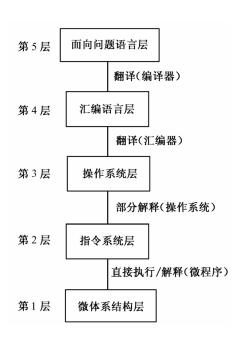
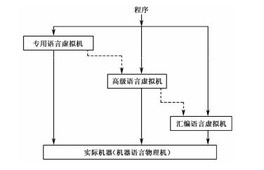
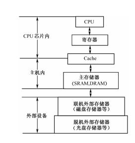

# 信息

《计算机组成原理与汇编语言程序设计（第4版）(高等学校规划教材)》 徐洁 电子工业出版社

# 摘录

## 硬件组成

在早期，冯·诺依曼将计算机的硬件组成分为5大部件。几十年来，计算机硬件系统已有了许多重大变化。首先，现在采用的大规模及超大规模集成电路，可将运算器和控制器集成在一块芯片上，合称为中央处理器（CPU）。它是负责执行程序，实现运算处理，控制整个系统的部件。相应地，原来的运算器现在作为CPU中的运算部件（又称为算术逻辑部件），它与控制器之间的界限已不像原来那样分明。其次，存储器分为高速缓存、主存储器、外存储器三个层次。其中高速缓存常集成在CPU内部，作为CPU的一个部分，也可以在CPU之外再设置一级高速缓存。通常将CPU与主存储器合在一起称为主机，主存储器（简称主存）就是因为位于主机之内而得名，有的书中又称它为内存储器（内存）。位于主机之外的磁盘、光盘、磁带等，则作为外存储器（外存）。还有，输入设备的任务是将外部信息输入主机，输出设备则是将主机的运算处理结果或其他信息从主机输出。但从信息传送控制的角度看，它们并无多大区别，不过是传送方向不同而已。有些设备还兼有输入与输出两种功能，所以在描述系统结构时常将它们合称为输入/输出设备，简称I/O设备。 

### cpu

CPU（CentralProcessingUnit）即中央处理器，是硬件系统的核心部件，负责读取并执行指令，也就是执行程序。
在CPU中有一个程序计数器PC（ProgramCounter），它存放着当前指令所在存储单元的地址。如果程序是顺序执行，在读取一个或连续几个存储单元的指令代码后，PC的内容就加1或加几，以指出下一条指令的地址；如果程序需要转移，则将转移地址送入PC。因此，PC就像一个指针，指引着程序的执行顺序。虽然指令与数据都采用二进制代码表示，在外形上没有区别，但可按照PC中的中的地址信息去读取指令，再按照指令给出的操作数地址去读取数据。
CPU内有一个或多个算术逻辑部件ALU（ArithmeticLogicUnit）。通常按照指令的要求将有关数据送入ALU，进行指定的算术或逻辑运算，然后将运算结果送到主存单元，或暂存在CPU内的寄存器中。CPU内的主要部分是控制器（又称为控制部件），它的任务是控制整个系统的工作，决定在什么时候，根据什么，发出什么命令，做什么操作。例如它控制着从主存中读取指令，根据指令代码分时地发出一些最基本的控制信号即微命令，控制存储器的读写、ALU的运算处理、数据的输入/输出等。按照产生微命令的方式不同，控制器可分为两大类：组合逻辑控制器及微程序控制器。
组合逻辑控制器完全靠若干组合逻辑电路（即硬件）产生微命令序列，将指令代码、状态信息、时序信号等输入到这些组合逻辑电路，电路将分时产生相应的微操作命令。这种控制器又称硬连逻辑控制器，其优点是形成微命令的速度快，常用于精简指令系统计算机（RISC）中。
微程序控制器是将微命令序列以代码形式编制成微程序，存入一个控制存储器中；当CPU执行指令时，通过读取并执行对应的一段微程序，产生微命令序列，控制完成指定的操作。微程序控制方式比较规整，硬件代价较小，易于扩充功能，但速度较慢。

### 主存储器

我们总是希望计算机系统中的存储器容量大，存取速度快，但这往往是有矛盾的，所以常将存储器分为几级。其中主存储器用半导体存储器构成，工作速度较高，也有一定的存储容量。外存储器为主存提供后援，由磁盘、光盘、磁带等构成，其存储容量很大，但速度较主存储器低。高速缓冲存储器、主存储器和外存储器，组合成一个完整的多级存储系统，使得整个系统既有很大的存储容量，而CPU又可以高速地访问存储器。主存储器用来存放需要执行的程序及需要处理的数据，能由CPU直接读出或写入。
主存储器的一项重要特性是：能按地址（单元编号）存放或读取内容，也就是允许CPU直接编址访问，通常以字节为编址单位。对主存储器来说，寻找存储单元（寻址）的依据是地址码，所存取的内容是指令或数据。

### 外存储器

外存储器用来存放那些需要联机存放，但暂不执行的程序和数据，当需要运行它们时再由外存调入主存。例如在光盘中存放着几个备用的软件，但当前暂时只用得着用得着其中的一个，我们先将它调入主存，其余软件仍存放在光盘上。又如一个信息管理系统所保存的数据很多，可将它们存放在磁盘之中，只将当前需要查询的部分调入主存，以后再调换。这样，主存的容量就不需要很大，可以做到速度比较快。而由磁盘、光盘等构成的外存储器容量很大，可为整个系统提供后援支持，其速度要求可以比主存低一些。
由于外存储器不由CPU直接编址访问，也就是说不需要按字节地从外存储器读取或写入，因此外存储器中的内容一般都按文件的形式进行组织，一个文件常分解为若干数据块，可以包含许多字节的信息。用户按文件名进行调用，CPU找到该文件在外存中的存放位置，以数据块为单位进行读写。

### 输入/输出设备

计算机系统大多配备了键盘、鼠标、显示器、打印机等常规输入/输出设备，简称I/O设备。

### 总线

怎样将CPU、主存、多台I/O设备连接成整机系统呢？现在普遍采用总线结构。所谓总线是指一组能为多个部件分时共享的信息传输线。

### 接口

一台计算机系统需连接哪些I/O设备，这要根据该系统的应用场合而定，因此通过系统总线连接的设备，其类型与数量都应当可以扩充。某种型号的计算机系统，其系统总线往往是标准的，也就是说，有多少根地址线、数据线，有哪些控制信号线，每个信号的名称及作用等，都是规定好的。

概括地说，计算机硬件系统是由三大子系统：CPU、存储系统（包括高速缓存、主存和外存）、输入/输出系统（包括输入/输出设备和接口），以及连接它们的总线构成。

## 计算机软件系统

### 系统软件

- 操作系统

- 编译程序与解释程序

计算机硬件能够直接识别的是数字代码，所以让计算机硬件执行的基本命令，如传送、加、减等，必须用0、1这样的数字编码来表示。由硬件执行的程序的最终形态是由若干指令组成的序列，即指令是程序（可执行形态）的基本单位。一般地，一条指令规定了一种基本操作（如传送、加、减），并提供操作数地址或直接提供操作数，这些信息都由数字代码表示。一台计算机可以执行的各种指令的集合，称为这种计算机的指令系统。显然，不同的机型往往具有不同的指令系统，以及相应的指令格式约定，所以机器指令代码又称为机器语言，即面向特定机器结构的一种内部语言。
如果直接用机器语言（0、1代码）编制程序，将非常不便，于是人们想到用一些约定的符号，如英文缩写的字符串，去表示操作含义、操作数、地址等，这就产生了汇编语言。汇编语言是一种用符号表示的与机器指令基本对应的程序设计语言，它专属于某种机型或某种系列机，其他计算机不能直接使用，所以是一种面向机器结构的程序设计语言，不是通用语言。
为了便于编制程序，现在所使用的绝大多数编程语言是高级程序设计语言，这是一些面向用户，与特定机器属性相分离的语言。高级程序设计语言与机器指令之间没有直接的对应关系，所以它可以在各种机型中通用，编程者使用高级语言也不必了解具体的机器指令系统及其他硬件属性。高级程序设计语言需要遵循一定的严格语法规定与格式，才能为语言处理程序（编译、解释）所识别。
机器语言是机器内部使用的、用数字代码表示的指令代码，面向某一特定机型，可由硬件直接识别并执行。汇编语言是一种用符号表示的，面向某一特定机型的程序设计语言，它的指令语句与机器指令一一对应。高级程序设计语言则是面向用户，与特定机器属性相分离的程序设计语言，具有通用性。
大多数情况下，用户采用高级程序设计语言编写程序，个别情况采用汇编语言编写程序。用这些程序设计语言编写出的程序叫做源程序，它们由一些语句组成。将源程序输入计算机后，计算机先执行一种语言处理程序，将源程序转换为机器语言代码序列，即机器语言程序，然后由计算机硬件执行这些用机器语言代码表示的指令序列，从而完成用户程序的执行过程。这种语言处理程序也是一种必需的系统软件。
语言处理方式有两种类型：解释与编译。解释方式是边解释边执行，为此需要一种针对某种程序设计语言的解释程序（又称解释器）作为系统软件的组成部分之一。将源程序输入计算机后，启动并执行相应的解释程序，它的作用是逐步分析源程序中的语句，按照源程序描述的过程，执行一个与此等价的机器语言指令序列，直到整个源程序都被扫描一遍，并被解释执行完毕为止。这有点像口译外语的情形，边说边翻译。解释方式适用于比较简单的程序设计语言，如BASIC。它的优点是支持人机对话方式的程序设计，可以边执行边修改；所需要的主存空间较小。但是这种方式的执行速度较慢，不能解释那些前后关联较多、较难理解的程序设计语言。大多数程序设计语言采用编译方式。将源程序输入计算机后，先启动并执行相应的编译程序（又称编译器），将源程序全部翻译成目标程序（目标代码）的机器语言指令序列。执行时，计算机将直接执行目标程序，不再需要源程序与翻译程序。因此，这种编译方式有点像笔译，得到完整的译文后就可以不要原文与译者了。在编译过程中，它所需的主存空间比解释方式多些，既要容纳源程序又要容纳一个比较大的编译程序；需花费的时间也要长些。但运行用户程序时，所需的主存空间比较小，执行速度也较快。
将汇编语言源程序转换为机器代码的目标程序的过程也是一种编译，人们将它专门称为“汇编”，相应的翻译程序称为汇编程序（又称汇编器）。它的逆过程叫做“反汇编”，即将用机器代码表示的目标程序（指令序列）反汇编成用汇编语言描述的程序。为利于二次开发，在剖析一些已有的重要软件时，常常需要进行反汇编。

- 各种软件平台

### 应用软件

应用软件不胜枚举，它一般包括：①科学计算类；②数据处理类；③自动控制类；④计算机辅助设计类；⑤人工智能类；等等。

## 计算机系统层次

### 从计算机系统组成角度划分层次结构

1. 微体系结构层
   微体系结构层是具体存在的硬件层次，在这一层我们看到的不是由大部件（即CPU、存储系统、输入/输出系统及互连机构）构成的计算机，而是更细微的机器结构。微体系结构层执行机器指令，它可看作是指令系统层指令的解释器。在由微程序控制数据通路的计算机上，微程序就是上一层指令的解释器。它通过数据通路逐条对指令进行取指、译码和执行。例如，对加法ADD指令，将首先取出指令进行译码分析，然后找到操作数送入寄存器，由ALU求和，最后存结果。结果到指定地方，如某个存储器单元。而在硬件直接控制数据通路的计算机上，执行的步骤与此类似，但是由硬件直接解释执行指令，并不存在一个真正的程序来解释上一层的指令。

2. 指令系统层
   原则上，指令系统层是机器语言程序员眼中所看到的计算机，当然现在人们并不使用机器语言编程。指令系统层位于微体系结构层之上，是一个抽象的层次，其主要特征就是指令系统。指令系统（又称指令集）是指一台计算机所能执行的全部指令的集合。其指令是由微体系结构层的微程序解释执行或硬件电路直接执行的。
   指令系统是计算机软件与硬件之间的一种接口。硬件系统的基本任务是实现指令系统所规定的各种指令功能，而各种程序只有最终转化为用机器语言（即代码表示的指令序列）才能被硬件执行。尽管现在已广泛应用各种高级语言编程，但需通过编译器或解释器将高级语言程序转换为硬件可以识别与执行的机器指令序列。
   指令系统层定义了硬件和编译器之间的接口，它是一种硬件和编译器都能理解的语言。一方面，指令系统表明了一台计算机具有哪些硬件功能，是硬件逻辑设计的基础。因此，在指令系统层，应该定义一套在当前和将来的技术条件下能够高效率实现的指令集，从而使高效率的设计可用于今后的若干代计算机中。另一方面，指令系统层应该为编译器提供明确的编译目标，使编译结果具有规律性和完整性。

3. 操作系统层
   从程序员的观点来看，操作系统是一个在指令系统层提供的指令和特性之上又增加了新指令和特性的程序。这一层有新的指令集，有不同的存储器结构，有同时运行两个或多个程序的能力，以及其他一些特性。
   尽管操作系统层和指令系统层都是抽象层次，但它们之间具有重要的区别。操作系统层指令集是系统程序员完全可用的指令集。它包括几乎所有的指令系统层的指令和操作系统层增加的新指令。这些新指令称为系统调用（SystemCall），如DOS操作系统的系统功能调用“INT21H”用于设备、文件和目录等管理，Linux操作系统的系统调用“fork()”用来创建一个进程。一个系统调用使用一条新指令调用一个预先定义好的操作系统服务，这样效率很高。一个典型的系统调用是从一个文件中读取数据。这一层增加的系统调用是由运行在指令系统层上的操作系统解释执行的。当一个用户程序执行一个系统调用时，比如从一个文件中读取数据，操作系统将一步步地执行这个调用。但是，那些和第2层指令相同的本层指令将直接交给微体系结构层执行，而不是由操作系统执行。换句话说，本层的新增指令由操作系统解释，而其他指令由微体系结构层直接执行，因此又将本层称为“混合层”。
   这一层并不是为普通程序员的使用而设计的，主要是为支持高层所需的解释器或翻译器运行而设计的。

4. 汇编语言层
   微体系结构层可看作指令系统层指令的解释器，使指令系统的功能得以实现。但是，直接用机器指令代码编程是非常困难的，而让微体系结构层直接执行高级语言也不是好办法。因此，人们为所有的计算机都设计了一个汇编语言层，它位于指令系统层、操作系统层与面向问题语言层之间。从这一层看去，每一种计算机都有一套自己的汇编语言、解释它的汇编器，以及相应的程序设计与开发方法。汇编语言层以及上层是提供给解决应用问题的应用程序员使用的。第1、2、3层提供的机器语言都是二进制代码，适合机器执行，但不容易被人理解。从第4层开始，其提供的语言是人们能理解的单词和缩略语。汇编语言实际就是“符号化”的机器语言，每一条汇编指令语句都对应一条机器语言指令，它是它是面向机器结构的语言。用汇编语言编写的程序先由汇编器翻译成机器语言程序，然后由微体系结构层解释执行。这一层支持上层的方法与低层不同。第2层和第3层主要用的是解释；而第4层和第5层通常用的是编译。

5. 面向问题语言层
   BASIC、C、C++、Java、LISP等

### 从语言功能角度划分层次结构

如果将计算机功能描述为“能执行用某些程序设计语言编写的程序”，那么用户看到的就是上图的语言功能层次模型。计算机硬件的物理功能是执行机器语言，称为机器语言物理机，从这一级看到的是一台实际的机器。而用户看到的是能执行某种语言程序的虚拟机，即通过配置某种语言处理程序后所形成的一台计算机。
与机器语言最接近的是汇编语言，它的基本成分是与指令系统一一对应的用助记符描述的汇编语句。与算法、数学模型甚至自然语言接近的，称为高级语言，它具有较强的通用性，在这一范畴内已推出了多种通用的高级程序设计语言。针对某些特定应用领域与用户，也可使用某种专用语言，它们一般面向应用，如所要求解的问题。
大多数计算机都是先将用程序设计语言编写的程序翻译为机器语言，然后才能执行。一般是直接翻译为机器语言。但当高级语言较复杂时，也可能分级编译，即先翻译为层次低些的某种中间语言，再将中间语言进一步翻译为机器语言，如上图虚线所示。
所谓虚拟机，通常是指通过配置软件（如某种语言的编译器或解释器）扩充机器功能后所形成的一台计算机。实际硬件在物理功能级上并不具备这种机器功能，因而称为虚拟机。采用虚拟机概念是计算机设计中的又一重要策略，它将提供给用户的功能抽象出来，使其脱离具体的物理机器，这有利于让用户摆脱真实物理机细节的束缚，获得超越物理机的功能。
广泛使用的Java虚拟机（JavaVirtualMachine，JVM）的概念。为了使Java程序能在不同的计算机上运行，Sun公司定义了一种称为Java虚拟机的虚拟体系结构。它有32位字组成的内存，能执行226条指令。大多数指令都很简单，只有一些比较复杂，需要多次内存循环。

### 软硬件逻辑上等价

如果说系统设计者必须关心软、硬件之间的界面，即哪些功能由硬件实现，哪些由软件实现；用户则更关心系统究竟能提供哪些功能。至于这些功能是由硬件还是软件实现，在逻辑功能上则是等价的，只是执行速度有差别而已。

### 计算机的性能指标

- 基本字长

- 数据通路宽度

- 运算速度

- 主存储器容量

- 外存容量

- 配置的外围设备及其性能

- 系统软件配置

### 提高计算机性能的若干技术

- 提高单CPU性能的若干技术
  （1）流水线处理技术
  （2）RISC（精简指令系统计算机）技术
  （3）超标量技术
  （4）平衡不同子系统的数据吞吐率

- 并行计算机

### 精简指令集计算机（RISC）

- 概念

随着超大规模集成电路VLSI技术的迅速发展，计算机系统的硬件成本不断下降，而软件成本却在不断上升。因此，人们热衷于在指令系统中增加更多的指令和更复杂的指令，以适应不同应用领域的需要，并考虑尽量缩短指令系统与高级语言之间的语义差异，以便于实现高级语言的编译和降低软件成本。另外，为了维护系列机的软件兼容性，也使指令系统变得越来越庞大。在系列机中，为了使老用户在软件上的投资不受损失，新机型必须继承老机器指令系统中的全部指令，这种情况使同一系列计算机的指令系统越来越复杂。一般来说，人们在计算机设计方面的传统想法和做法是：字长愈长、性能愈高的计算机，其指令系统就应该愈复杂，按这种传统方法设计的计算机系统称为复杂指令系统计算机，简称CISC。指令系统很复杂、功能很强并不一定能提高机器的速度，CISC中采用很多复杂的寻址方式，为了计算有效地址需花费一定的时间；有的指令需要多次访问主存储器，所以执行速度会降低。

复杂指令系统的实现需要复杂的控制器来支持，并且系列机为实现兼容，其控制部件多用微程序控制方式来实现，以便于指令系统的扩展。但微程序控制部件执行一条机器指令通常需要几个微周期，因此严重降低了指令的执行速度。为了提高指令的执行速度，CISC中常采用流水线技术。但由于存在很多问题，例如指令系统采用变字长指令、不同指令争用共同资源以及转移指令等，使流水线的效率不高。以上情况表明，传统的CISC设计思想并不利于提高计算机的速度。而且复杂的指令系统必然增加硬件实现的复杂性，从而使计算机的研制周期长、投资大。因此人们开始研究指令系统的合理性问题。对CISC指令系统运行的统计分析表明，各种指令的使用频率相差悬殊，最常用的是一些比较简单的指令，仅占指令总数的20%，但在程序中出现的频率却占80%。1975年，IBM公司提出了精简指令系统的想法。后来美国加利福尼亚大学伯克利分校的RISCI和RISCII、斯坦福大学的MIPS机的研制成功，为精简指令系统计算机（简称RISC）的诞生与发展起了很大作用。

- RISC的特点

精简指令系统计算机的着眼点不是简单地放在简化指令系统上，而是通过简化指令使计算机的结构更加简单合理，更易于流水线的实现，从而提高处理速度。
  （1）面向寄存器的结构所有运算使用的数据都来自寄存器，运算结果也都写入寄存器。寄存器的典型长度是32位或64位。通常CPU内应设置大量的通用寄存器，以减少访问主存储器。
  （2）采用LOAD/STORE结构
  （3）较少的指令数和寻址方式
  选取使用频率最高的一些简单指令，以及很有用但不复杂的指令，可简化控制部件。选用简单的寻址方式，有利于减少指令的执行周期数。
  （4）所有指令长度相同
  （5）硬布线控制逻辑
  （6）注重编译的优化
  RISC指令系统的简化，必然使编译生成的代码长度增长。但通过编译优化技术，将编译初步生成的代码重新组织，调度指令的执行次序，以充分发挥内部操作的并行性，从而进一步提高流水线的执行效率。虽然编译优化技术使编译时间拉长，但这种代价的结果是使程序的执行时间缩短。而且程序的编译工作只需一次，编译后生成的优化执行代码却可以高效率地执行多次。因此这个代价是值得的。

### 存储系统

在物理构成上，存储系统通常分为3层：高速缓冲存储器Cache、主存和外存。Cache与主存常由半导体存储器构成；外存常由磁盘及光盘构成，也可以看作是I/O设备。一个高性能的计算机系统要求存储器的存储容量大，存取速度快，成本低廉，能支持复杂系统结构。这些要求往往相互矛盾，彼此形成制约。因此在一个计算机系统中，常采用几种不同的存储器，构成多级存储体系，以适应不同层次的需要。通常，对CPU直接访问的一级，其速度尽可能快些，而容量相对有限；作为后援的一级其容量尽可能大些，而速度可以相对慢些。经过合理的搭配和组织，对用户来说，整个存储系统能够提供足够大的存储容量和较快的存取速度。
从用户的角度看，存储器还可以形成另一种层次结构，即物理存储器与虚拟存储器。物理存储器是指系统的物理组成中实际存在的主存，主存容量决定了实存空间的大小。在高档计算机中，依靠操作系统的软件支持及部分硬件的支持，可以使用户访问的编程空间远比实际主存空间大，用户感觉自己可编程访问一个很大的存储器，这个存储器称为虚拟存储器。

#### 存储器的分类

- 按存储器在计算机系统中的作用分类
  （1）内部存储器内部存储器（简称内存或主存）是计算机主机的组成部分，用来存储当前运行所需要的程序和数据，CPU可以直接访问内存并与其交换信息。相对外部存储器而言，内存的容量小、存取速度快。由于CPU要频繁地访问内存，所以内存的性能在很大程度上影响了整个计算机系统的性能。
  （2）外部存储器外部存储器也称辅助存储器或后援存储器，简称外存或辅存。外存用于存放当前不参加运行的程序和数据，以及一些需要永久保存的信息。外存设在设在主机外部，其容量大，但存取速度相对较慢，CPU不能直接访问它，而必须通过专门的设备才能对它进行读写（如磁盘驱动器等），这是它与内存之间的一个本质区别。
  （3）高速缓冲存储器高速缓冲存储器（Cache）位于主存和CPU之间，用来存放正在执行的程序和数据，以便CPU能高速地访问它们。Cache的存取速度可以与CPU的速度相匹配，但其价格昂贵，存储容量较小。目前的微处理器通常将Cache或Cache的一部分制作在CPU芯片中。

- 按存取方式分类
  （1）随机存取存储器RAM（RandomAccessMemory）随机存取存储器是可读可写的存储器，CPU可以对RAM单元的内容随机地读/写访问，对任一单元的读出和写入的时间是一样的，即存取时间相同，并且与存储单元在存储器中所处的位置无关。RAM读/写方便，使用灵活，但断电后信息会丢失。RAM主要用作主存，也可用作高速缓存。
  （2）只读存储器ROM（ReadOnlyMemory）只读存储器可以看作RAM的一种特殊形式，其特点是：存储器的内容只能随机读出而不能写入。这类存储器用来存放那些不需要改变的信息。由于信息一旦写入存储器就固定不变了，即使断电信息也不会丢失，所以又称它为固定存储器。ROM除了存放某些系统程序外，还用来存放专门的子程序，或用作函数发生器、字符发生器及微程序控制器中的控制存储器。有些ROM在特定条件下用特殊的装置或程序可以重新写入。
  （3）顺序存取存储器SAM（SequentialAccessMemory）顺序存取存储器的存取方式与前两种完全不同，它的内容只能按某种顺序存取，存取时间的长短与信息在存储器上的物理位置有关，所以SAM只能用平均存取时间作为衡量存取速度的指标。磁带机就是典型的顺序存取存储器。
  （4）直接存取存储器DAM（DirectAccessMemory）直接存取存储器既不像RAM那样能随机地访问存储器
  存储器的任何一个存储单元，也不像SAM那样完全按顺序存取，而是介于两者之间。存取信息时，第1步直接指向存储器的某个小区域（如磁盘上的磁道）；第2步在小区域内顺序检索或等待，直到找到目的地后再进行读/写操作。这种存储器的存取时间也与信息所在的物理位置有关，但比SAM的存取时间要短。磁盘是最常见的直接存取存储器。

- 按存储介质分类
  （1）磁芯存储器
  （2）半导体存储器
  （3）磁表面存储器
  （4）光盘存储器

- 按信息的可保存性分类
  断电后存储信息即消失的存储器，称为易失性存储器或挥发性存储器，RAM是易失性存储器。断电后信息仍然保存的存储器，称为非易失性存储器，也称为非挥发性存储器或永久性存储器，ROM、磁芯存储器、磁表面存储器和光盘存储器都是非易失性存储器。

#### 主存的主要技术指标

- 存储容量
- 存取速度
- 可靠性
- 存取宽度

#### 高速缓冲存储器Cache

计算机系统整体性能的高低与许多因素有关，如CPU的主频、存储器的存取速度、系统架构、指令结构、信息在各部件之间的传送速度等。而CPU与主存之间的存取速度是一个很重要的因素。如果只是CPU工作速度很高，而主存的存取速度较低，就会造成CPU经常处于等待状态，既降低了处理速度，又浪费了CPU能力。为了减小CPU与主存之间的速度差异，现代微机中通常在慢速的DRAM和快速的CPU之间插入一个速度较快、容量较小的SRAM，起到缓冲作用，使CPU既能以较快速度存取SRAM中的数据，又不使系统成本上升过高，这就是Cache技术。

由此可以想到，如果把一段时间内在一定地址范围中被频繁访问的信息集合成批地从主存读到一个能高速存取的小容量存储器中存放起来，供程序在这段时间内随时使用，从而尽量减少访问速度较慢的主存的次数，可以加快程序的运行速度，这就是Cache的设计思想，即在CPU和主存之间设置一个小容量的高速缓冲存储器（Cache）。  Cache中存放着最近要使用的程序与数据，作为主存中当前最急需执行信息的副本。其容量约为数KB到数百KB，由于容量较小，可以选用高速半导体存储器，使CPU访存速度得到提高。在高档微处理器中，在CPU芯片内集成了1～2个高速缓存，称为片内Cache，还允许在CPU芯片外扩充Cache。
有了Cache，系统在工作时总是不断地将与当前指令集相关联的一个不太大的后继指令集从主存读到Cache，然后再向CPU高速传送，从而达到速度匹配。当CPU需要访存时，同时将地址送往主存与Cache。若所需访问的内容已经在Cache中，则可直接从Cache中快速读取信息，这称为访问Cache命中；若访问的内容不在Cache中，即未命中，则从主存中读取信息，并考虑更新Cache，使其成为当前最急需部分。为此需要实现访存地址与Cache物理地址间的映像变换。
由于局部性原理不能保证所请求的数据百分之百地在Cache中，这里便存在一个命中率问题。所谓命中率，就是在CPU访问Cache时，所需信息恰好在Cache中的概率。命中率越高，正确获取数据的可能性就越大，目前Cache的访问命中率可达到90%以上。因此只要合理组织三级存储体系，从整体上讲，CPU就能以接近Cache的速度访问存储器，而总存储容量相当于联机外存的总容量。
一般来说，Cache的存储容量比主存的容量小得多，但不能太小，太小会使命中率太低。但也没有必要过大，过大不仅会增加成本，而且当Cache容量超过一定值后，命中率随容量的增加将不会有明显增长。所以Cache的空间与主存空间在一定范围内应保持适当比例的映射关系，以保证Cache有较高的命中率，且系统成本不会过多地增加。Cache的命中率与Cache的映像方式、替换算法、程序特性等因素有关。

#### 存储系统的层次结构

 要真正解决存储器的容量、速度、价格之间的矛盾，不能只是将上面的各个层次的存储器进行简单组合，必须在系统结构上采取措施，采用不同速度、不同容量和不同价格的多种存储器件，按层次组成存储系统。各个层次的存储器之间通过硬件和软件有机地结合成一个统一的整体，无需程序员的干预而由计算机自动地实现调度，向程序员提供足够大的存储空间，同时最大限度地与CPU速度相匹配。按这样的思想组成的存储层次结构，称为存储体系结构。
典型的三级存储体系结构，分为“高速缓存—主存—辅存”三个层次。现在的计算机系统大多具备这三级存储结构。三级存储体系又分为两个层次，高速缓存和主存之间形成Cache-主存层次，主存和辅存之间形成主存-辅存层次。 

- Cache-主存层次　
  通过辅助硬件将Cache和主存构成一个整体，如上图所示。从整体上看，该层次具有接近于Cache的存取速度、主存容量和平均位价格，解决了存储器高速与低成本之间的矛盾。这个层次完全由硬件实现，不受软件的干预，因此对所有程序员都是透明的。
- 主存-辅存层次　
  随着操作系统和硬件技术的发展，利用附加硬件及存储管理软件，使主存和辅存构成一个整体，形成主存-辅存层次，如图上图所示。辅存只与主存交换信息，不能直接由CPU访问。从整体上看，该层次的存取速度接近于主存的存取速度，容量则接近于辅存的容量，而位价格也接近于廉价的辅存平均价格，从而解决了大容量和低成本之间的矛盾。三级存储体系结构的总的效果是：存取速度接近于Cache，存储容量接近于辅存容量，整体价格也比较合理。

#### 磁盘冗余阵列

廉价冗余磁盘阵列（RedundantArraysofInexpensiveDisk，RAID）是用多台磁盘存储器组成的大容量外存子系统，它是由多台磁盘机按一定规则（如分条、分块、交叉存取等）组合在一起构成的。通过阵列控制器的控制和管理，磁盘阵列系统能够将几个、几十个甚至几百个硬盘组合起来，使其容量高达几百GB甚至上千GB。其基础是数据分块技术，即在多个磁盘上交错存放数据，通过阵列控制器实现数据的并行、交叉存储或单独存储操作。由于阵列中的一部分磁盘存有冗余信息，一旦系统中某一磁盘失效，可以利用冗余信息重建用户数据。

- RAID0级（无冗余和无校验的数据分块）
  数据分布在阵列中的所有磁盘上，与单个大容量磁盘相比，它的显著优点是：如果两个I/O请求正在等待不同的数据块，则被请求的块有可能在不同的盘上。因此，两个请求能够并行发出，减少了I/O的排队时间。RAID0级具有最高的I/O性能和磁盘空间利用率，但无容错能力，增加了系统出故障的几率。若阵列中有一块磁盘损坏，将造成不可弥补的损失。其安全性甚至低于常规的硬盘系统，所以不适于对数据稳定性要求高的应用。
- RAID1级（镜像磁盘阵列）
  由磁盘对组成，每个工作盘都有对应的镜像盘，上面保存着与工作盘完全相同的数据。如果镜像盘组中一个物理磁盘出现故障，系统可以使用未受影响的另一个磁盘继续操作，数据不会丢失，但磁盘空间的利用率只有50%。RAID1级的安全性高，而主要缺点是价格昂贵，它需要支持2倍于逻辑磁盘的磁盘空间。因此，RAID1级的配置只限于存储系统软件、数据和其他关键文件的驱动器中。在这种情况下，RAID1级对所有的数据提供实时备份，在磁盘损坏时，所有的关键数据仍立即可用。
- RAID2级（具有纠错海明码的磁盘阵列）
- RAID3、4、5、6、7级
- RAID10级（RAID0级+RAID1级）
  这是一种复合的RAID模式，将RAID0的速度与RAID1的冗余特性相结合，既可提供数据分块，又能提供镜像功能，是所有RAID中性能最好的磁盘阵列，但每次写入时要写两个互为镜像的盘，价格高。这种结构特别适用于既有大量数据需要存取，同时又对数据安全性要求严格的领域，如银行、金融、商业超市、仓储库房、各种档案管理等。

#### 虚拟存储系统的组织

虚拟存储系统建立在主存-辅存层次上，是由附加硬件装置及存储管理软件组成的存储体系，它使计算机具有接近主存的存取速度，并具有辅存的容量和位成本。
在采用磁盘作为后援存储器后，可以在存储管理部件和操作系统存储管理软件的支持下，将主存和辅存的地址空间统一编址，使用户获得一个很大的编程空间，其容量大大超过实际的主存储器。这个在用户界面上看到的存储器，被称为虚拟存储器（VirtualMemory，VM），这样的虚拟存储技术对用户来说，自然是极有价值的，因而已在计算机系统中广泛使用，高档微处理器芯片也为此提供了有关硬件支撑。从用户界面看，用户可使用位数较长的编程地址进行编程，这种地址面向程序的需要，不必考虑程序将来在主存储器中的实际位置，因而称为逻辑地址。它是面向虚拟存储器的，所以又称为虚地址。在用户看来，CPU可按虚地址访问一个很大的存储器，其容量甚至可达整个辅存容量，显然这是一种虚拟层次。
在实际的物理存储层次上，所编程序和数据在操作系统管理下，先送入磁盘，然后操作系统将当前急需运行的部分调入主存，供CPU操作，其余暂不运行部分留在磁盘中，随程序执行的需要，操作系统自动地按一定替换算法进行调度，将当前暂不运行部分调回磁盘，将新的模块由磁盘调入主存。这一层次上的工作，对用户是透明的。CPU执行程序时，需将程序提供的虚地址变换为主存的实际地址（实地址、物理地址）。一般是先由存储管理部件判断该地址的内容是否在主存中，若已调入主存，则通过地址变换机制将虚地址转换为实地址，然后访问主存单元；若尚未调入主存，则通过缺页中断程序，以页为单位调入或实现主存内容调换。从原理上看，虚拟存储器与Cache-主存层次有很多相似之处，如地址映像方式和替换策略。但是，Cache-主存层次的控制完全由硬件实现，它对各类程序员都是透明的；而虚拟存储器的控制是由硬件与软件结合实现，对应用程序员来说是透明的，但对于设计存储器管理软件的系统程序员来说是不透明的。

